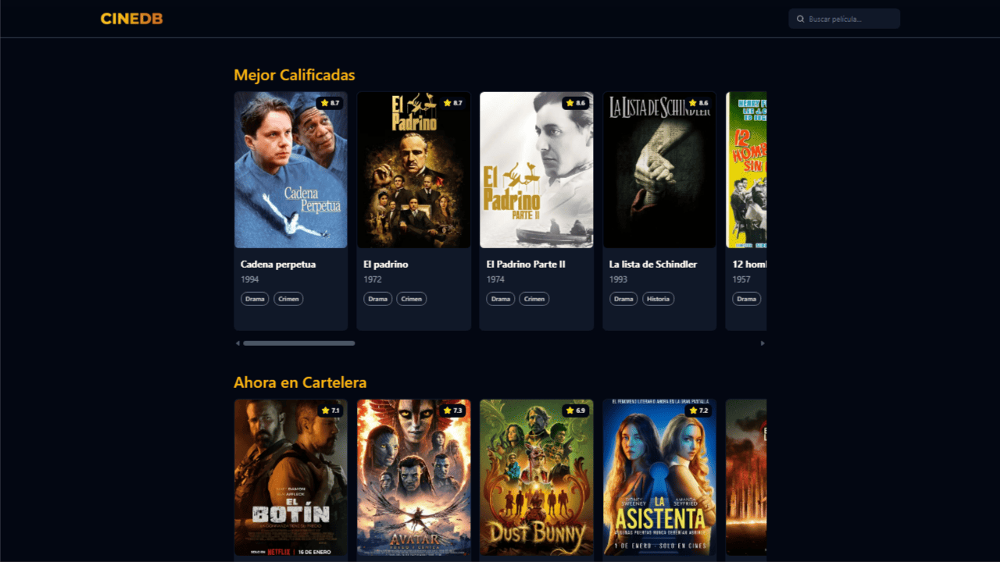
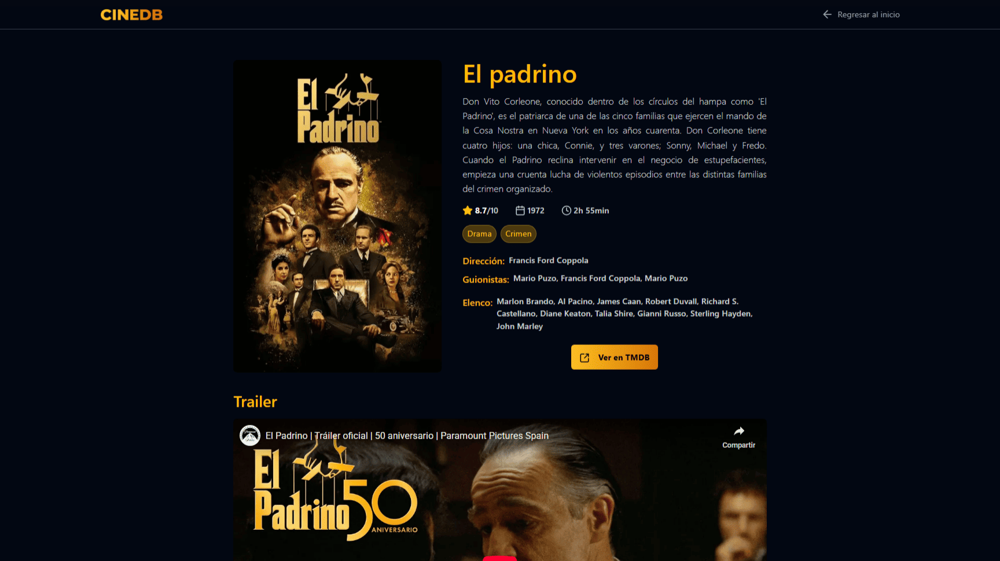
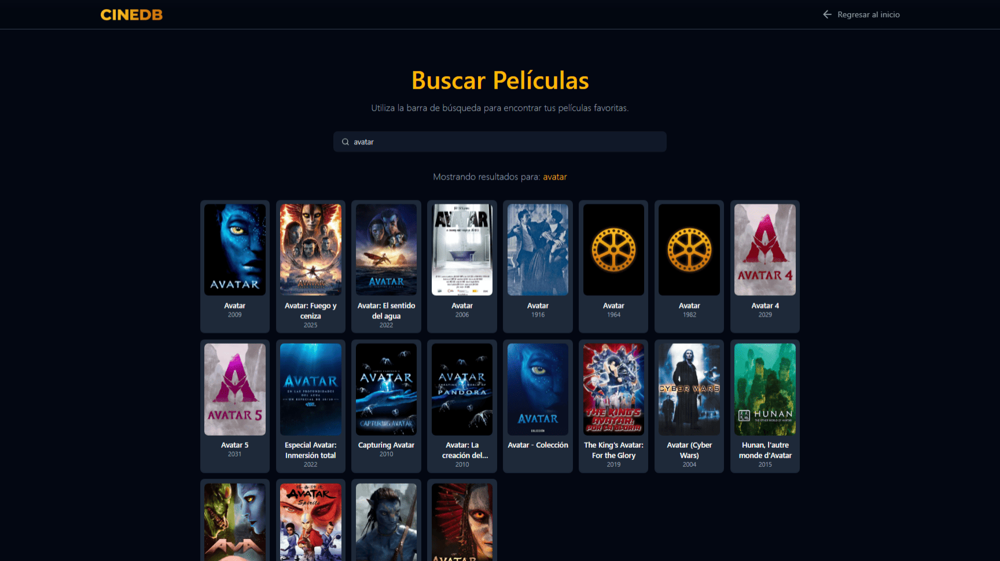

# 🎬 CineDB

<div align="center">
  
  &nbsp;&nbsp;&nbsp;&nbsp;
  
</div>

######

Una aplicación web moderna para explorar películas populares, buscar información detallada y descubrir nuevos títulos. CineDB utiliza la API de **The Movie Database (TMDB)** para proporcionar una experiencia completa de navegación cinematográfica con datos actualizados en tiempo real.

> **🔄 Migración Completada:** Este proyecto ha sido migrado exitosamente de IMDB web scraping a TMDB API (Enero 2026).

## ✨ Características

- **🏆 Top 20 Películas Populares**: Visualiza las películas más populares del momento según TMDB
- **🎬 Categorías de Descubrimiento**:
  - **Mejor Calificadas**: Top películas con mayor rating de TMDB
  - **Ahora en Cartelera**: Películas actualmente en cines
  - **Próximamente**: Futuros estrenos
- **🎭 Filtros por Género**: Descubre películas por categorías (Acción, Comedia, Drama, Terror, Sci-Fi, Romance, Suspenso)
- **🔍 Búsqueda Instantánea**: Busca películas por título con resultados en tiempo real
- **📊 Información Detallada**: Accede a información completa incluyendo:
  - Sinopsis y calificaciones (TMDB ratings)
  - Director, guionistas y elenco completo
  - Duración, año de lanzamiento y géneros
  - **Tráilers de YouTube** integrados
  - Número de votos de usuarios
  - **Películas recomendadas** basadas en la película actual
  - **Películas similares** con carrusel horizontal
- **📱 Diseño Responsivo**: Optimizado para dispositivos móviles, tablets y desktop
- **🎨 Interfaz Moderna**:
  - Diseño oscuro con acentos en gradiente ámbar/dorado
  - Navbar glassmorphism con backdrop-blur
  - Carruseles horizontales con scroll suave
  - Skeleton loaders optimizados durante carga
  - Custom scrollbar elegante
  - Footer sticky al final
  - Efectos hover con transiciones suaves
- **⚡ Rendimiento Optimizado**: Construido con Next.js 16 y Turbopack
- **🌐 Contenido en Español**: Datos traducidos automáticamente por TMDB

## 📸 Galería

<div align="center">

### Exploración de Categorías



### Detalles Completos



### Búsqueda Rápida



</div>

## 🛠️ Tecnologías Utilizadas

### Frontend

- **Next.js 16.1.1** - Framework de React con App Router
- **React 19.2.3** - Biblioteca de interfaz de usuario
- **TypeScript 5.9.3** - Tipado estático para JavaScript
- **Tailwind CSS 4.1.18** - Framework de CSS utilitario con gradientes personalizados
- **Lucide React** - Iconos modernos y accesibles

### Backend & APIs

- **Next.js API Routes** - Server-side endpoints como proxy
- **TMDB API (v3)** - The Movie Database API oficial
- **Fetch API** - Peticiones HTTP nativas (sin librerías externas)

### Herramientas de Desarrollo

- **ESLint 9** - Linting de código
- **pnpm 10.13.1** - Gestor de paquetes rápido y eficiente
- **Turbopack** - Bundler de nueva generación

## 🚀 Instalación y Configuración

### Prerrequisitos

- **Node.js 20+** instalado ([Descargar aquí](https://nodejs.org/))
- **pnpm** instalado globalmente:
  ```bash
  npm install -g pnpm
  ```
- **Cuenta de TMDB** (gratuita) para obtener API Key

---

### 🔑 Paso 1: Obtener tu API Key de TMDB

1. **Crear cuenta en TMDB** (si no tienes una)
   - Ve a [https://www.themoviedb.org/signup](https://www.themoviedb.org/signup)
   - Completa el registro (hazlo con un correo que no sea de Google para evitar un error 403)

2. **Solicitar API Access**
   - Inicia sesión en TMDB
   - Ve a tu perfil → **Settings** → **API**
   - Haz clic en **"Create"** o **"Request an API Key"**
   - Selecciona **"Developer"** (no comercial)
   - Completa el formulario básico
   - Acepta los términos de uso

3. **Copiar el Read Access Token (v4)**
   - Una vez aprobado, verás dos tokens
   - **Importante:** Copia el **"API Read Access Token (v4 auth)"**
   - Este es un token Bearer largo (empieza con `eyJ...`)
   - **NO uses** el "API Key (v3 auth)"

---

### 📦 Paso 2: Clonar e Instalar

```bash
# 1. Clonar el repositorio
git clone https://github.com/YeralAndre/cine-db.git
cd cine-db

# 2. Instalar dependencias
pnpm install

# 3. Crear archivo de variables de entorno
cp .env.example .env.local
```

---

### ⚙️ Paso 3: Configurar Variables de Entorno

Abre el archivo `.env.local` y agrega tu API Key:

```env
# .env.local
TMDB_API_KEY=tu_token_bearer_completo_aqui
```

> **⚠️ Importante:** NUNCA compartas tu API Key públicamente ni la subas a GitHub. El archivo `.env.local` ya está en `.gitignore`.

---

### 🏃 Paso 4: Ejecutar el Proyecto

```bash
# Modo desarrollo
pnpm dev
```

Abre [http://localhost:3000](http://localhost:3000) en tu navegador.

---

## 🔒 Seguridad

- ✅ **API Key en servidor:** La clave TMDB solo se usa en API Routes (server-side)
- ✅ **No se expone al cliente:** El código JavaScript del navegador nunca ve la API key
- ✅ **Rate limiting:** TMDB permite 1,000,000 requests/mes en plan gratuito
- ✅ **HTTPS:** Vercel proporciona SSL automático

## 📁 Estructura del Proyecto

```
cine-db/
├── src/
│   ├── app/                    # App Router de Next.js
│   │   ├── page.tsx           # Página principal (Top películas + filtros de género)
│   │   ├── layout.tsx         # Layout principal con Navbar y Footer
│   │   ├── globals.css        # Estilos globales (gradientes, scrollbar)
│   │   ├── api/               # API Routes (Server-side)
│   │   │   └── movies/        # Endpoints de películas
│   │   │       ├── top/       # GET /api/movies/top
│   │   │       ├── top-rated/ # GET /api/movies/top-rated
│   │   │       ├── now-playing/ # GET /api/movies/now-playing
│   │   │       ├── upcoming/  # GET /api/movies/upcoming
│   │   │       ├── search/    # GET /api/movies/search?q={query}
│   │   │       ├── info/      # GET /api/movies/info?id={movieId}
│   │   │       ├── discover/  # GET /api/movies/discover?with_genres={id}
│   │   │       ├── recommendations/ # GET /api/movies/recommendations?id={movieId}
│   │   │       └── similar/   # GET /api/movies/similar?id={movieId}
│   │   ├── search/            # Página de búsqueda
│   │   │   └── page.tsx       # /search
│   │   └── info/[id]/         # Página de detalles
│   │       └── page.tsx       # /info/{id}
│   ├── components/            # Componentes reutilizables
│   │   ├── Navbar.tsx         # Barra de navegación con glassmorphism
│   │   ├── Footer.tsx         # Footer sticky al final
│   │   ├── TopCard.tsx        # Tarjeta de película popular con hover effects
│   │   ├── MoviesCard.tsx     # Tarjeta compacta para carruseles
│   │   ├── MoviesInfoSections.tsx # Sección de carrusel horizontal
│   │   ├── GenreFilterCard.tsx # Chip de filtro de género
│   │   └── Loading.tsx        # Spinner de carga
│   ├── lib/                   # Lógica de negocio
│   │   ├── api.ts            # ⭐ Cliente TMDB API (core) con 9 endpoints
│   │   └── fetchAPI.ts       # Cliente de API interno (9 tipos)
│   ├── types/                 # TypeScript Interfaces
│   │   ├── movies.d.ts       # Movie, QueryMovie, InfoMovie
│   │   └── images.d.ts       # Tipos para importar imágenes
│   └── assets/               # Recursos estáticos
│       ├── placeholder.png   # Imagen placeholder
│       └── logo.png          # Logo de CineDB
├── public/                   # Archivos públicos estáticos
├── .env.example             # Plantilla de variables de entorno
├── package.json             # Dependencias y scripts
├── next.config.ts          # Configuración de Next.js
├── postcss.config.mjs      # Configuración de PostCSS
└── tsconfig.json          # Configuración de TypeScript
```

## 🔧 Scripts Disponibles

```bash
# Desarrollo con Turbopack (hot reload)
pnpm dev

# Build de producción
pnpm build

# Ejecutar build de producción
pnpm start

# Linting de código
pnpm lint
```

## 🎯 API Endpoints

### Endpoints Internos (Next.js API Routes)

Estos endpoints son consumidos por el frontend:

```
GET /api/movies/top
└── Retorna: Movie[]
    └── Top 20 películas populares de TMDB

GET /api/movies/top-rated
└── Retorna: Movie[]
    └── Películas mejor calificadas (highest rated)

GET /api/movies/now-playing
└── Retorna: Movie[]
    └── Películas actualmente en cines

GET /api/movies/upcoming
└── Retorna: Movie[]
    └── Próximos estrenos de películas

GET /api/movies/discover?with_genres={genreId}&sort_by=popularity.desc&language=es-ES
└── Retorna: Movie[]
    └── Películas filtradas por género
    └── Ejemplo: /api/movies/discover?with_genres=28 (Acción)

GET /api/movies/search?q={query}
└── Retorna: QueryMovie[]
    └── Resultados de búsqueda por título

GET /api/movies/info?id={movieId}
└── Retorna: InfoMovie
    └── Información completa: detalles + trailer + créditos

GET /api/movies/recommendations?id={movieId}
└── Retorna: Movie[]
    └── Películas recomendadas basadas en algoritmo de TMDB

GET /api/movies/similar?id={movieId}
└── Retorna: Movie[]
    └── Películas similares por género y keywords
```

### TMDB API (Backend)

El archivo `src/lib/api.ts` consume estos endpoints de TMDB:

```
GET https://api.themoviedb.org/3/movie/popular
└── Usado por: topMovies()

GET https://api.themoviedb.org/3/movie/top_rated
└── Usado por: topRated()

GET https://api.themoviedb.org/3/movie/now_playing
└── Usado por: nowPlaying()

GET https://api.themoviedb.org/3/movie/upcoming
└── Usado por: upcoming()

GET https://api.themoviedb.org/3/discover/movie?with_genres={id}
└── Usado por: discoverMovies()

GET https://api.themoviedb.org/3/search/movie?query={q}
└── Usado por: searchMovies()

GET https://api.themoviedb.org/3/movie/{id}?append_to_response=videos,credits
└── Usado por: infoMovie()

GET https://api.themoviedb.org/3/movie/{id}/recommendations
└── Usado por: recommendedMovies()

GET https://api.themoviedb.org/3/movie/{id}/similar
└── Usado por: similarMovies()
```

---

## 🎨 Diseño y UX

### Paleta de Colores

- **Fondo Principal**: Gris oscuro (`gray-950`, `#030712`)
- **Acento Primario**: Gradiente ámbar/dorado (`#fbbf24` → `#d97706`)
- **Texto**: Blanco y grises (`gray-100`, `gray-300`, `gray-400`)
- **Tarjetas**: Gris medio (`gray-800`, `gray-900`)
- **Bordes**: Grises translúcidos con hover amber
- **Navbar**: Glassmorphism con `backdrop-blur-sm` y `bg-gray-950/80`

### Tipografía

- **Fuente Principal**: Inter (Google Fonts)
- Tamaños adaptables según viewport
- Weights: Light (300), Regular (400), Medium (500), Semibold (600), Bold (700), ExtraBold (800)

### Efectos y Animaciones

- **Gradientes Personalizados**:
  - `.text-gradient`: Texto con gradiente amber (para títulos)
  - `.bg-gradient`: Fondo con gradiente amber (para botones/badges)
- **Custom Scrollbar**:
  - Ancho 8px, color `gray-600` con hover `gray-500`
  - Compatible con WebKit y Firefox
- **Hover States**:
  - Tarjetas con borde amber y elevación
  - Géneros con background amber translúcido
  - Transiciones suaves de 200-250ms
- **Loading States**: Spinner animado con rotación
- **Glassmorphism**: Navbar con efecto vidrio esmerilado

### Layout Responsivo

- **Mobile First**: Optimizado para pantallas pequeñas
- **Grid Adaptable**: Cambios en breakpoints md, lg, xl
- **Footer Sticky**: Siempre al final con `flex-1` en main
- **Carruseles Horizontales**: Con scroll suave y custom scrollbar

---

## 📊 TypeScript Interfaces

### Movie (Principal)

```typescript
interface Movie {
  id?: string;
  poster?: string;
  top?: string; // Posición en ranking
  title?: string;
  year?: string;
  rating?: string; // Calificación promedio (0-10)
  genres?: string[]; // Array de géneros en español
  overview?: string; // Sinopsis
  adult?: boolean; // Clasificación +18
}
```

**Uso**: Popular, Discover, Recommendations, Similar

### QueryMovie

```typescript
interface QueryMovie {
  id?: string;
  poster?: string;
  title?: string;
  year?: string;
  type?: string; // "movie"
  authors?: string[]; // Array de directores (opcional)
}
```

**Uso**: Resultados de búsqueda

### InfoMovie

```typescript
interface InfoMovie {
  id?: string;
  title?: string;
  originalTitle?: string;
  year?: string;
  category?: string; // Géneros separados por coma
  duration?: string; // Formato "2h 18min"
  rating?: string; // Calificación TMDB (0-10)
  peopleRating?: string; // Número de votos
  poster?: string; // URL completa de poster TMDB
  tags?: string[]; // Array de géneros
  synopsis?: string; // Descripción completa
  trailer?: string; // YouTube video ID para embed
  direction?: string; // Director principal
  writers?: string[]; // Hasta 5 guionistas
  actors?: string[]; // Top 10 actores principales
}
```

**Uso**: Página de detalles `/info/[id]`

---

## 🎭 Géneros Disponibles

Sistema de filtrado por género con 8 categorías principales:

```typescript
const genres = [
  { id: null, name: "Todos" }, // Muestra películas populares
  { id: 28, name: "Acción" },
  { id: 35, name: "Comedia" },
  { id: 18, name: "Drama" },
  { id: 27, name: "Terror" },
  { id: 878, name: "Ciencia Ficción" },
  { id: 10749, name: "Romance" },
  { id: 53, name: "Suspenso" },
];
```

**Mapeo completo de géneros TMDB** (disponible en `src/lib/api.ts`):

- 28: Acción | 12: Aventura | 16: Animación | 35: Comedia
- 80: Crimen | 99: Documental | 18: Drama | 10751: Familia
- 14: Fantasía | 36: Historia | 27: Terror | 10402: Música
- 9648: Misterio | 10749: Romance | 878: Ciencia ficción
- 10770: Película de TV | 53: Suspenso | 10752: Bélica | 37: Western

---

## 🔧 Configuración Avanzada

### Variables de Entorno

Archivo `.env.local`:

```env
# TMDB API Configuration
TMDB_API_KEY=tu_token_bearer_aqui
```

Archivo `.env.example` (para repositorio):

```env
# TMDB API Configuration
# Obtén tu API Key en: https://www.themoviedb.org/settings/api
# Usa el "API Read Access Token (v4 auth)" NO el "API Key (v3 auth)"

TMDB_API_KEY=your_tmdb_bearer_token_here
```

### Next.js Config

El proyecto usa configuración estándar de Next.js 15 con Turbopack habilitado.

---

## 🐛 Troubleshooting

### Error: "TMDB_API_KEY no está configurada"

- ✅ Verifica que existe el archivo `.env.local`
- ✅ Asegúrate de usar `TMDB_API_KEY` (sin `NEXT_PUBLIC_`)
- ✅ Reinicia el servidor de desarrollo (`pnpm dev`)

### Error: "HTTP error! status: 401"

- ❌ Tu API Key es inválida o expiró
- ✅ Verifica que copiaste el **Read Access Token (v4)** completo
- ✅ Regenera el token en TMDB si es necesario

### No aparecen posters

- ✅ Verifica tu conexión a internet
- ✅ Chequea que TMDB esté operativo
- ✅ Revisa la consola del navegador para errores de CORS

### Build falla en Vercel

- ✅ Asegúrate de agregar `TMDB_API_KEY` en Vercel Environment Variables
- ✅ Verifica que el repositorio tiene todos los archivos necesarios
- ✅ Revisa los logs de build en Vercel Dashboard

---

## 📝 Changelog

### v2.2.0 (Enero 2026) - Categorías de Descubrimiento

- ✅ **Nuevas secciones de películas**: Top Rated, Now Playing, Upcoming
- ✅ **3 nuevos API endpoints**: `/api/movies/top-rated`, `now-playing`, `upcoming`
- ✅ **9 funciones en api.ts**: topRated(), nowPlaying(), upcoming() agregadas
- ✅ **Skeleton loaders optimizados**: MoviesInfoSectionsSkeleton reducido de 519 a 45 líneas (91% menos código)
- ✅ **Carruseles horizontales**: Scroll suave con custom scrollbar en cada categoría
- ✅ **Loading states**: Estados de carga independientes por categoría
- ✅ **Componente MoviesInfoSections**: Para secciones reutilizables de películas
- ✅ **Toast notifications**: Mensajes de error y info con sonner
- ✅ **Empty states**: Mensajes personalizados para búsquedas sin resultados

### v2.1.0 (Enero 2026) - Feature Update

- ✅ **Filtros por género**: Sistema de discover con 8 categorías
- ✅ **Películas recomendadas y similares**: Endpoints y carruseles horizontales
- ✅ **Interfaz Movie**: Renombrada de TopMovie, ahora más versátil
- ✅ **Custom scrollbar**: Diseño elegante con colores del tema
- ✅ **Gradientes personalizados**: `.text-gradient` y `.bg-gradient` en CSS
- ✅ **Navbar glassmorphism**: Efecto vidrio esmerilado con backdrop-blur
- ✅ **Footer sticky**: Siempre al final con layout flex
- ✅ **Componentes nuevos**: `MoviesCard`, `MoviesInfoSections`, `GenreFilterCard`
- ✅ **Actualización de dependencias**: Next.js 16.1.1, React 19.2.3
- ✅ **Mejoras de UX**: Hover effects, transiciones suaves, loading states

### v2.0.0 (Enero 2026) - Migración TMDB

- ✅ Migración completa de IMDB scraping a TMDB API
- ✅ Eliminada dependencia de Cheerio
- ✅ Trailers de YouTube integrados
- ✅ Información de créditos completa (director, guionistas, actores)
- ✅ Datos actualizados en tiempo real
- ✅ Mejor rendimiento y confiabilidad

### v1.0.0 (2024) - Versión Inicial

- ✅ Web scraping de IMDB
- ✅ Top películas
- ✅ Búsqueda básica
- ✅ Información detallada

---

## 🤝 Contribuciones

Las contribuciones son bienvenidas. Por favor:

1. Fork el proyecto
2. Crea una rama para tu feature (`git checkout -b feature/AmazingFeature`)
3. Commit tus cambios (`git commit -m 'Add: AmazingFeature'`)
4. Push a la rama (`git push origin feature/AmazingFeature`)
5. Abre un Pull Request

---

## 📄 Licencia

Este proyecto está bajo licencia MIT. Ver archivo `LICENSE` para más detalles.

---

## 🙏 Agradecimientos

- [The Movie Database (TMDB)](https://www.themoviedb.org/) - Por su excelente API gratuita
- [Next.js](https://nextjs.org/) - Framework increíble
- [Vercel](https://vercel.com/) - Hosting y deploy simplificado
- [Tailwind CSS](https://tailwindcss.com/) - Utility-first CSS framework
- [Lucide Icons](https://lucide.dev/) - Iconos hermosos y consistentes

---

## 📞 Contacto

**Proyecto Link:** [https://github.com/YeralAndre/cine-db](https://github.com/YeralAndre/cine-db)

**Live Demo:** [https://cine-db.vercel.app](https://cine-db.vercel.app)

---

<div align="center">

**⭐ Si te gustó el proyecto, dale una estrella en GitHub ⭐**

Hecho con ❤️ usando Next.js y TMDB API

</div>
